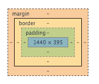

# CSS Cheat Sheet {#css-cheat-sheet}

This cheat sheet shares some commonly used CSS properties. If you want to know how to do something googling it is usually very helpful often taking you to stack overflow or w3schools.  Try searching google for css margin to get a better understanding of the margin property.  Another place to look is the documentation on the mozilla developer network pages here: [bit.ly/MDNDOC](https://www.google.com/url?q=http://bit.ly/MDNDOC&sa=D&ust=1478381675896000&usg=AFQjCNESi-TmaUMe3gxizIbEZhB_sh5TwQ) 

| Property | Description | Value | Example |
| --- | --- | --- | --- |
| margin | Adds spacing around an element outside the border (refer to the box model diagram to the left) | Any pixel number value | `p { margin: 10px; } p { margin: 0 auto; }` |
| padding | Add spacing between the element content and the element border (refer to the box model diagram above) | Any pixel number value | `p { padding: 10px 0 15px 20px }` |
| border | Specifies the border styling | Width: any pixel number value | `p { border: 2px solid blue; }` |
| color | Sets the font color | Hex color values or color names | `p { color: #ffffff; }` |
| text-align | Aligns text according to value | left | `p { text-align: center; }` |
| text-decoration | Add decoration to text | none | `a { text-decoration: none; }` |
| font-family | Set the font family (or typeface) of the text | Any font name | `p { font-family: Neuton, "Times New Roman", Times, serif; }` |
| font-size | Set the size of the text | Numeric value in px, em or rem | `h1 { font-size: 4em; }` |
| font-style | Sets the text style | Normal | `h4{ font-style: italic; }` |
| font-weight | Set the weight of the text | normal |` h3 { font-weight: bold }` |
| background-color | Sets the color of the selected elements background | Any hex color value or color name | `body { background-color: #ffffff; }` |
| background-image | Set the background of the element to the image supplied | Image url | `.hero { background-image: url(‘images/image.png’); }` |
| background-repeat | Specifies whether or not a background image should be repeated | repeat | body { |
| background-position | Sets the starting position of a background image | center center | .hero { |
| list-style-type | Determines the bullet style on the list | circle | ul { |
| float | Specifies whether an element should float. | Right | img { |
| clear | Does not allow floating to the specified side of an element | Right | .footer { |