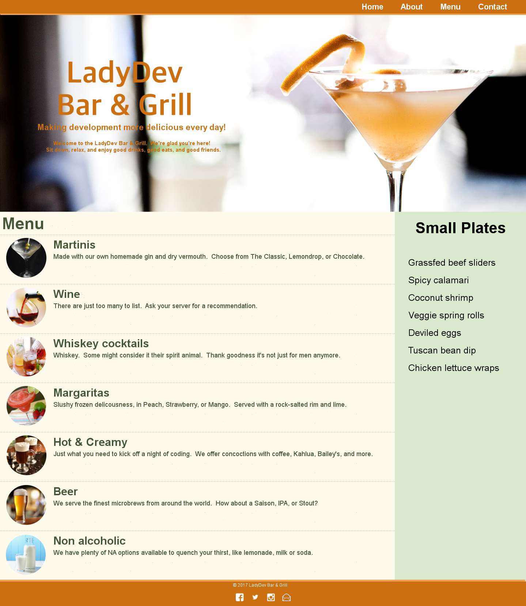

# Setup {#top}

Tonight we'll add styles to "LadyDev Bar & Grill" web page. If you follow our instructions your page will end up looking like the example below but feel free to add in some of your own creativity if you feel comfortable!

<!-- trick markdown to give me a little space between these two sections of text -->
## 
If this is your first time at Coding & Cocktails [click here to install the tools](http://bit.ly/CnCTheTools).

<!-- trick markdown to give me a little space between these two sections of text -->
## 

If you are using a Chromebook, please skip to the <a href="#chromebook-instructions">Chromebook instructions</a> below!


## Prepare the HTML file {#html-file} 


## Helpful tips as you work through the worksheet

View the worksheet and your IDE in split screen. 

For Windows users, use `windows key` + `left arrow` or `windows` + `right arrow` to resize the application and position to the left or right half of your screen.

For Mac users, hold down the full-screen button in the upper-left corner of a window to shrink and position to the left or right side of the screen. Release the button, then click another window to begin using both windows side by side.

Mentors are happy to help!



Did you know you can collapse the table of contents for worksheets?

Click on the hamburger menu (<i class="fa fa-bars" aria-hidden="true"></i>) at the top of the page to toggle the table of contents.


<!-- trick markdown to give me a little space between these two sections of text -->
## 
<!--sec data-title="Chromebook instructions" data-id="section0" data-show=true data-collapse=true ces-->

<!--endsec-->