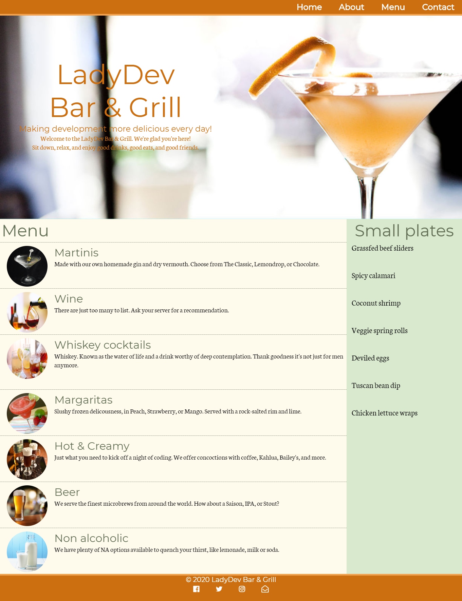

# CSS Basics {#top}
CSS decorates your website with visual appeal and invites the user to connect with your website's personality. Tonight we'll apply CSS to the "LadyDev Bar & Grill" web page. If you follow our instructions your page will end up looking like the example below but feel free to add in some of your own creativity if you feel comfortable! 

<!-- trick markdown to give me a little space between these two sections of text -->
## 

This section will help guide you through the following steps:



<!-- trick markdown to give me a little space between these two sections of text -->
## 
If you are using a Chromebook, please skip to the <a href="#chromebook-instructions">Chromebook instructions</a> below!


## Create and link the stylesheet to the HTML {#link-stylesheet} <a href="#top" title="Take me to the top of page"><i class="fa fa-chevron-circle-up" aria-hidden="true"></i></a>


## Resize images using relative and absolute sizes {#sizes} <a href="#top" title="Take me to the top of page"><i class="fa fa-chevron-circle-up" aria-hidden="true"></i></a>
Images are a big part of any website and what most people see first because your eyes are drawn to visuals. Let’s learn about absolute and relative sizing and apply it to the images in the menu.


## Change the color of the title {#text-color} <a href="#top" title="Take me to the top of page"><i class="fa fa-chevron-circle-up" aria-hidden="true"></i></a>
Color helps differentiate sections within a website and helps convey importance. In this section we'll change the color of the "LadyDev Bar & Grill" title.


## Cascade background color changes {#cascade} <a href="#top" title="Take me to the top of page"><i class="fa fa-chevron-circle-up" aria-hidden="true"></i></a>
The ability to cascade styles makes CSS powerful. In this section we will apply background colors to demonstrate how to cascade styles.


<!-- trick markdown to give me a little space between these two sections of text -->
## 

## Checkpoint <a href="#top" title="Take me to the top of page"><i class="fa fa-chevron-circle-up" aria-hidden="true"></i></a>
Compare your _styles.css_ against the answer key for your work so far. It might look a little different depending on the color palette you chose.  


<!-- trick markdown to give me a little space between these two sections of text -->
## 

## References and helpful links <a href="#top" title="Take me to the top of page"><i class="fa fa-chevron-circle-up" aria-hidden="true"></i></a>
[Mozilla Developer Network CSS reference documentation](https://developer.mozilla.org/en-US/docs/Web/CSS/Reference)

<!-- trick markdown to give me a little space between these two sections of text -->
## 
<!--sec data-title="Chromebook instructions" data-id="section0" data-show=true data-collapse=true ces-->

<!--endsec-->