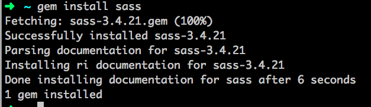
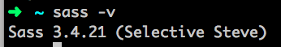

# Prep Work {#prep-work}

1.  Utilize our Tools worksheet ([bit.ly/cnctools](https://www.google.com/url?q=http://bit.ly/cnctools&sa=D&ust=1478381675839000&usg=AFQjCNEo0H0QH4Tl46B_p9ead6rl-JknfA) ) to install our recommended tools prior to the session.   
2.  Another Sublime Text plugin you’ll want to have installed for Sass development is called Sass.  You can view installation instructions here: [bit.ly/cncsass](https://www.google.com/url?q=http://bit.ly/cncsass&sa=D&ust=1478381675841000&usg=AFQjCNHvVVK8DNs_0o8gjG2wRbWIAmkljA)  
3.  Sass has a Ruby dependency this means we need Ruby (another programming language) installed to use it.

1.  Windows based machines please follow the instructions here: [rubyinstaller.org](https://www.google.com/url?q=http://rubyinstaller.org/&sa=D&ust=1478381675842000&usg=AFQjCNHTp8QGUMU7SFot4Y5DI6fCO6B00w) 
2.  Macs, you’re lucky, you’ve already got it installed.  

1.  Open your command line terminal (Git Bash on Windows, iTerm2 on Macs) and type the command:

    `gem install sass`

    Output should look similar to :<br>

    

1.  Check that you’ve got everything installed by typing

```sass -v```


 Output should look like this:<br>

