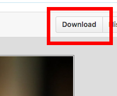

1. In Atom, right click on the "CSS" folder on the left pane and select "New Folder". Name the folder "images".
1. Navigate to our GitHub repository at [https://github.com/KansasCityWomeninTechnology/CSSCompilerPractice/tree/master/images](https://github.com/KansasCityWomeninTechnology/CSSCompilerPractice/tree/master/images). 
1. Click on each image filename to view the file. Then, click the "Download" button in the upper right corner above the displayed image.

    
1. Save the files into your "images" folder. 
	
	When you're done, your "images" folder should contain:
	```
	beer.jpg
	hero.jpg
	hot-cocktail.jpg
	margarita.jpg
	martini.jpg
	milk.jpg
	whiskey-cocktails.jpg
	wine.jpg
	```
